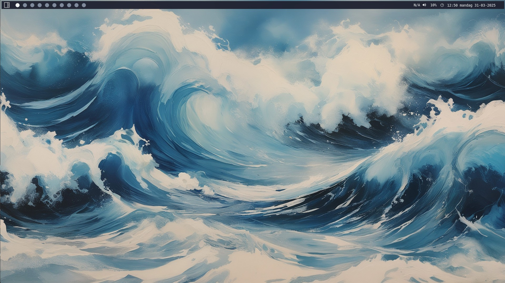

# Qmade - Now my daily driver.
Qtile Martin Andersen Desktop Environment, Qmade for short.!

## Remember to install Debian without a desktop environment.
Install a fresh copy of Debian Linux - Stable via the Netinst installer ISO.
After installation Debian, Reboot the computer and login with your username and password.
Start the installation as regular users with SUDO rights, after you login to your freshly installed machine.

Run this one command to start Qmade install and you're good to go.: 

    curl -sfL https://raw.githubusercontent.com/ITmail-dk/qmade/main/install.sh | bash

*Or you can run these commands... if you think it's easier.*

    sudo apt install -y git && git clone https://github.com/ITmail-dk/qmade && cd qmade && . install.sh

## Keybindings
Default Modkey is the Windows key (**MOD4**) and **MOD1** is Alt Left.

**WIN + Enter** = Opens a Terminal.

**WIN + B** = Opens a browser.

**WIN + E** = Thunar File Explorer.

**WIN + SHIFT + E** = Yazi File Explorer in a ScratchPads.

**WIN + CTRL + ALT + P** = Power Menu for shutdown, reboot and lock screen.

**WIN + SHIFT + A** = Pavucontrol, Audio Control Panel.

**WIN + ALT + A** = Toggle between two sources like speaker and headphones. (Setup in file ~/.audio-toggle)

**WIN + CTRL + ALT + T** = Autogenerate a new background image and color theme, 
from the Wallpaper folder in your home directory.

For a quick reference to the keybindings used in Qmade, 
check out the Qtile config file under Keybindings in "~/.config/qtile/config.py" to see them all.

## Custom commands after installation
- "qmade update" Updates Qtile + QMADE and the Python virtual environment,  and some fire properties for sddm.

## Information:
- Window Manager: Qtile (Github From Source)
- Compositor: X11, Picom
- Bar / Panel: Qtile Bar
- Terminal: Kitty
- Shell: Bash
- Web browser: Google Chrome & WaterFox
- Editor: Neovim + Notepadqq
- File Manager: Thunar + Yazi & Midnight Commander
- Notification Manager: Dunst
- Application Launcher: Rofi
- Login Manager: SDDM
- Audio Server: PipeWire, WirePlumber
- Theme: EliverLara Nordic
- Icons: Nordzy
- Cursors: Nordzy
- Colors: PyWal 16 (From the Wallpaper)
- Fonts: Noto & Jet Brains Mono + Roboto Mono (Nerd Fonts)

## Roadmap:
- Compositor: Wayland + XWayland
- Audio: Needs work and better setup process and configuration
