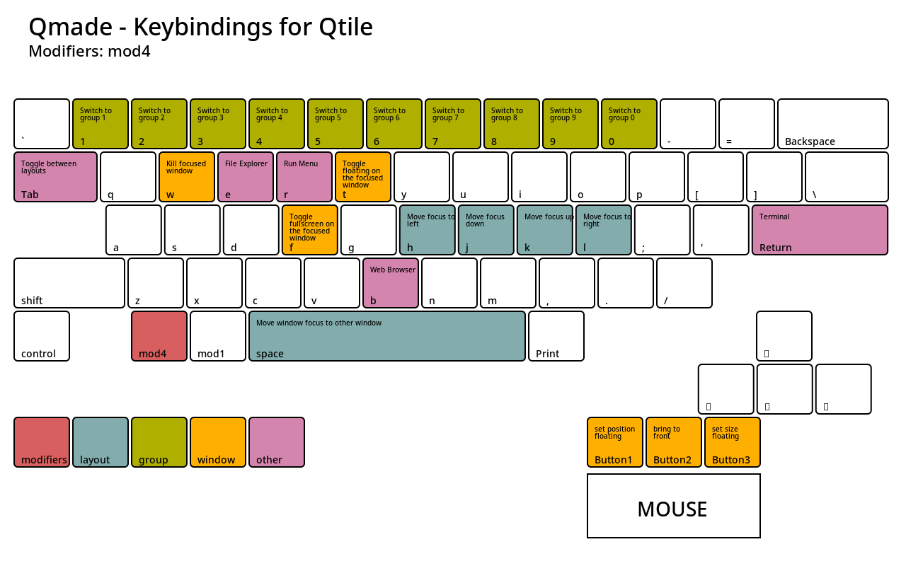

# Qmade - Dev testing start.
Qtile Martin Andersen Desktop Environment, Qmade for short.!

## Remember to install Debian without the desktop environment.
After installation Debian, Reboot the computer and login with your username and password.
Start the installation as regular users with SUDO rights, after you login to your freshly installed machine.

Run this one command to start Qmade install and you're good to go.: 

`bash -c "$(wget -O- https://raw.githubusercontent.com/ITmail-dk/qmade/main/install.sh)"`

*Or you can run these commands... if you think it's easier.*

`sudo apt install -y git && git clone https://github.com/ITmail-dk/qmade && cd qmade && . install.sh`

## Keybindings
Default Modkey is the Windows key (**MOD4**) and **MOD1** is Alt Left.

**MOD4 + Enter** = Opens a Terminal.
**MOD4 + B** = Opens a browser.

**MOD4 + Control + MOD1** = Autogenerate a new background image and color theme, from the Wallpaper folder in your home directory.

For a quick reference to the keybindings used in Qmade, 
check out the image files in the `keybinding-images` directory.

